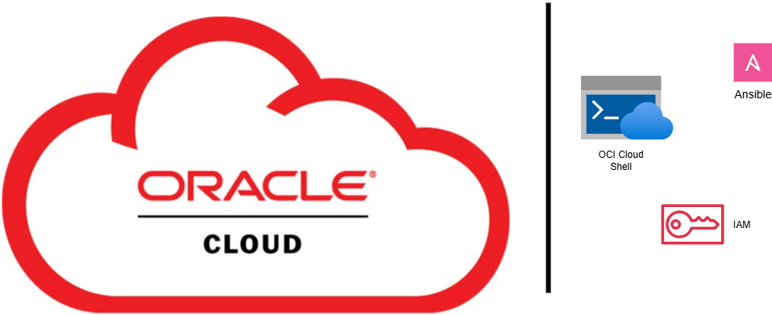

# OCI IAM Automation with Ansible

This project automates the creation of groups, policies, and users in **Oracle Cloud Infrastructure (OCI)** using **Ansible Playbooks**.  

**Identity and Access Management (IAM) in OCI** is used to securely control access to cloud resources. It enables administrators to define **who** can access specific resources and **what actions** they can perform.  

- **Users**: Individual identities within OCI. Each user is assigned credentials and can be added to one or more groups.  
- **Groups**: A collection of users. Instead of assigning permissions to users one by one, groups allow easier management of access by assigning policies at the group level.  
- **Policies**: Rules written in a human-readable language that specify access permissions. For example, a policy can allow a group of users to manage compute instances or read object storage.  
- **Compartments**: Logical partitions within OCI to organize and isolate resources. IAM policies can be scoped to compartments, ensuring better access control and resource segregation.  
- **Dynamic Groups**: Special groups where membership is determined by resource attributes (e.g., all instances with a specific tag), often used to give permissions to resources like compute instances.  
- **Federation**: Integration with an external identity provider (e.g., Microsoft Active Directory, Oracle Identity Cloud Service) to enable single sign-on (SSO) for users.  

By automating these IAM components with Ansible, the project ensures **consistent, repeatable, and secure** provisioning of access controls across OCI environments.

## Benefits of Using This Automation

- **Time-saving**: Automates the creation of multiple users, groups, and policies, reducing manual effort significantly.  
- **Consistency**: Ensures uniform configuration and access policies across all users and groups, eliminating human errors.  
- **Scalability**: Easily add or update a large number of users and permissions without repetitive manual steps.  
- **Security**: Reduces the risk of misconfigured access controls, ensuring users have the right level of access.  
- **Reusability**: The Ansible playbooks can be reused across different compartments or OCI environments with minimal changes.  
- **Auditability**: Provides a repeatable and documented process for IAM management, making audits and compliance checks easier.  
- **Efficiency**: Frees up administrator time to focus on higher-value tasks instead of repetitive IAM setup.  

